# Born2beroot
***Officially finished at 2022-xx-xx / Grade: xxx of 100 / Versión en [español](LEEME.md)***

This practice is an introduction to systems administration. In this internship you have learned the principles of:

- The creation of **virtual machines**
- **OS installation** with strict encryption and partitioning rules
- **Security**. Implementation of sudo, a firewall and a strong password policy
- **Remote access**. Implementing an SSH server
- **User Management**. Working with users, groups and their privileges
- **Monitoring**. Knowing how to extract information from the machine (available RAM, number of active connections, commands executed through sudo...)

## Software used[^1]
- VM: [VirtualBox](https://www.virtualbox.org/) 6.1
- OS: [Debian](https://cdimage.debian.org/debian-cd/current/amd64/iso-cd/) bullseye 11.3.0 ([Debian vs CentOS](annex/1_Debian_VS_CentOS.en.md))

## 1. CREATE THE [VIRTUAL MACHINE](annex/2_What_is_a_VM.md)
At the top of the VirtualBox main window, click on **New** to start.


Put a name to the machine, decide where to install it and specifies which linux is going to be on the VM (in my case Debian). If you are using 42 computers because space reasons, you should create the virtual machine in the **/sgoinfre/goinfre/Perso/your_42_login**. Otherwise, you can put it on a large enough USB or an external hard drive.

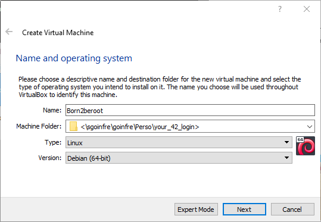

As programs that are going to consume a lot of RAM are not going to be installed, such as the graphical environment or other types of utilities that are running in the background, the default **1024MB is enough**, but to make sure **I have doubled it to 2GB**.


Now you must choose the option to **create a new virtual hard disk**.


Here the default partition of VirtualBox, **VirtualBox Disk Image**, will be left.


The default option of letting the hard drive be **dynamically allocated** is fine.


For the size of the hard drive, **12 GB is enough** for both the mandatory and additional parts. Note that the larger the disk size, the longer it will take to create the signature, which is not convenient for Born2beroot evaluation.

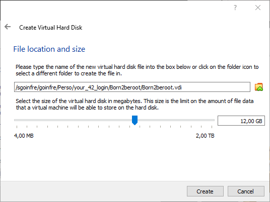

End, Born2beroot virtual machine has been created.

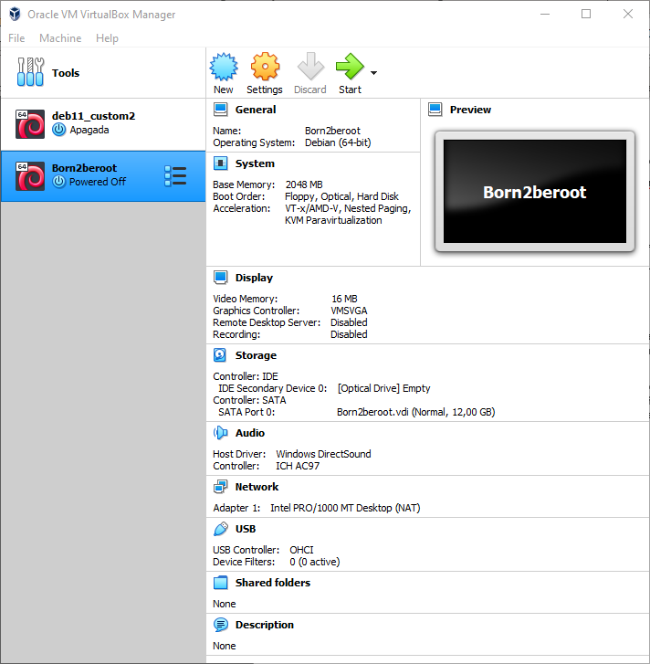

## INSTALLING DEBIAN ON VM
Before running the virtual machine, as it does not have any operating system, you have to assign the OS .iso that you have downloaded to be able to boot from it.

||||
|-|-|-|

Once this is done, when you start the VM, the Debian installation menu appears with different options. You are interested in one of the first 2: Graphical install or Install. Both are used to install the OS, the difference between them is that the first one has a simpler graphical interface. In this case, the “**Install**” option will always be used, although the way to proceed is very similar in either of the 2 options.


The first step is to choose the installation language that you want, in my case I will leave it in **English**.


Then it's time to choose your geographical region (for issues related to the time zone, number formats, text...). **For the purpose of this exercise it is indifferent**.


Now you must choose the keyboard layout you want to use [more info](https://en.wikipedia.org/wiki/Keyboard_layout), in my case, I use a keyboard based on the Spanish layout.


Regarding the hostname of the machine, the exercise specifies that the name must be composed of **your intra login followed by 42**.


The domain name does not need to be configured in this practice, so **leave it blank**.

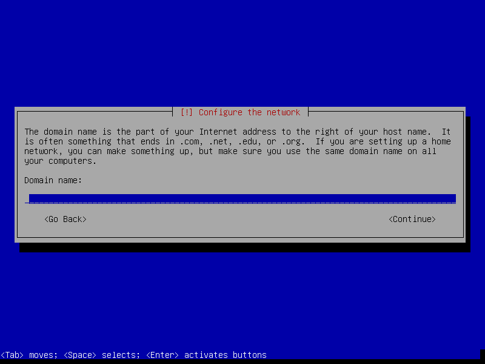

For the password of the root user, you have to define a strong password following the rules that the statement of this exercise establishes.


Once the administrator is configured, it is time to create a user. The name, it is recommended that it be your intra login, since it is the user that is going to be evaluated, and the password that has to follow the same rules as the root password.

||||
|-|-|-|

### MANUAL PARTITIONING
Now it's time to partition the disk. Although the installer has different options, the partitions that are requested in the mandatory part and in the bonus force you to use the **manual mode**, [more information about partitions, LVM and encryption](annex/3_Partitions_LVM_Encryption.md).


Now you have to choose the disk where the partitions are going to be created (there should only be one called “**SCSIX (0,0,0) (sda) - […] HARDDISK**”). You will have to create 2 partitions, one for the boot loader and another encrypted partition where the LVM volumes will be.

|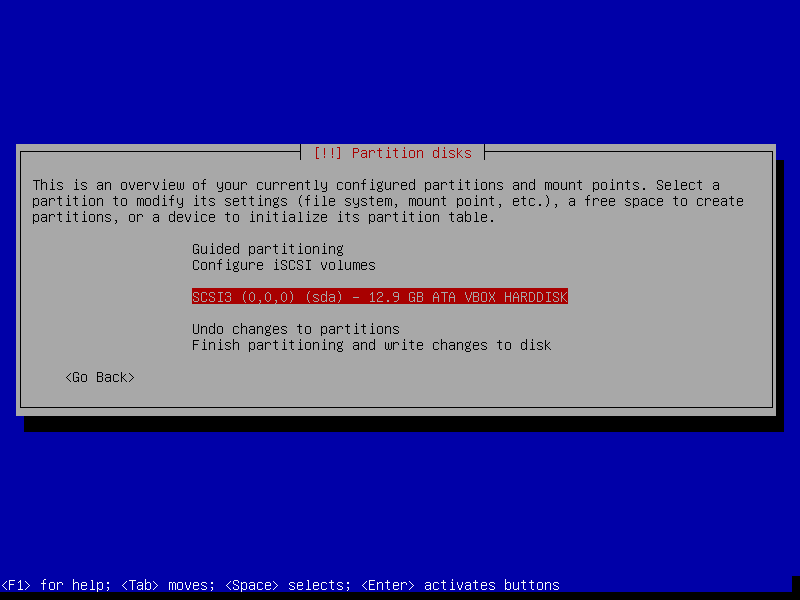|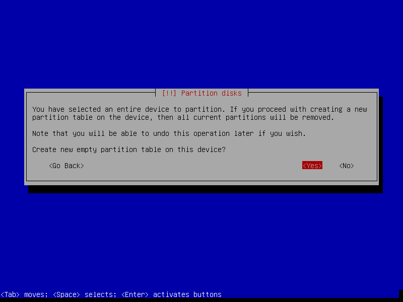|
|-|-|

In the next step you will be shown the new partition table created where you have to do the segmentation you want. The first partition to be created will be the boot partition, which should NOT be encrypted, otherwise the OS would not even boot. Select the **free space** of the disk.


**Create a new partition**.

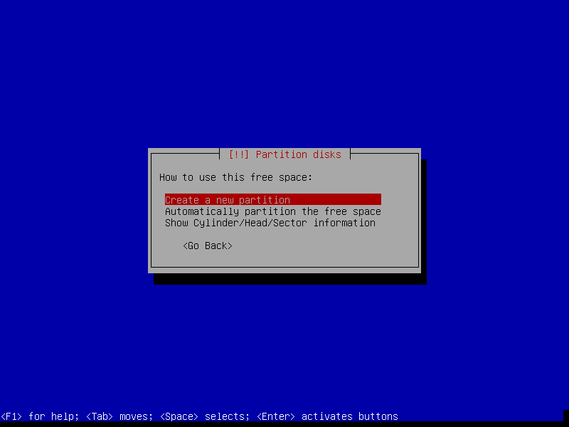

A space of **500 MB** should be enough.


The partition must be of type **primary**.

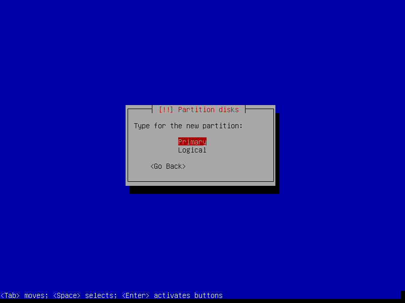

And, the boot, it is recommended to create it at the **beginning**.

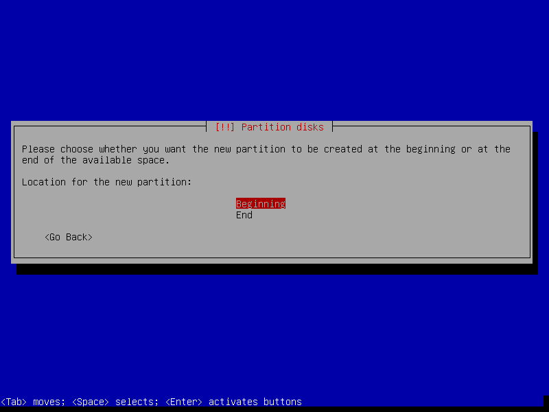

Now you have to say what the partition is going to be used for, in this case it will be **mounted** as **/boot**.

||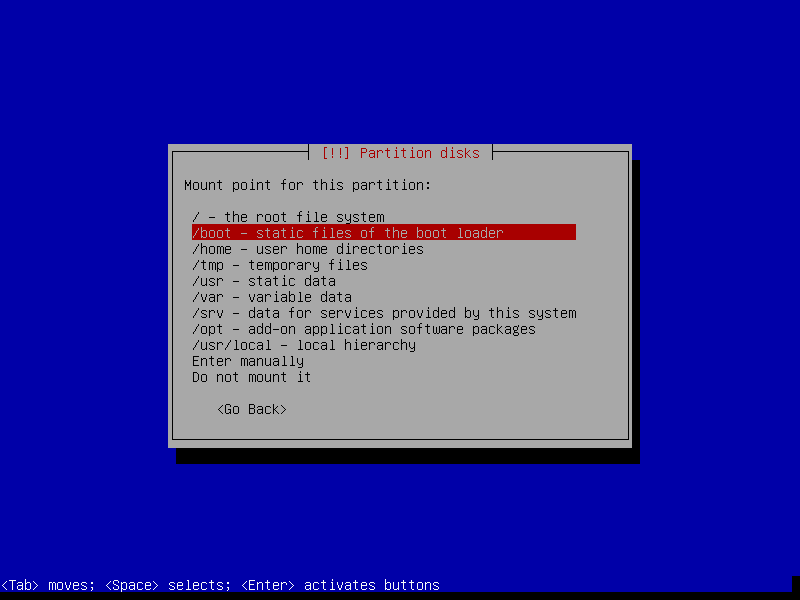|
|-|-|

Finally, click on **done**. And you have now created the boot partition.


Now it's time to create the LVM partition where all the other volumes will be. So, select the remaining **free space and create a new partition**.

|||
|-|-|

For the size, select the remaining space.


This time it will be **logical**.

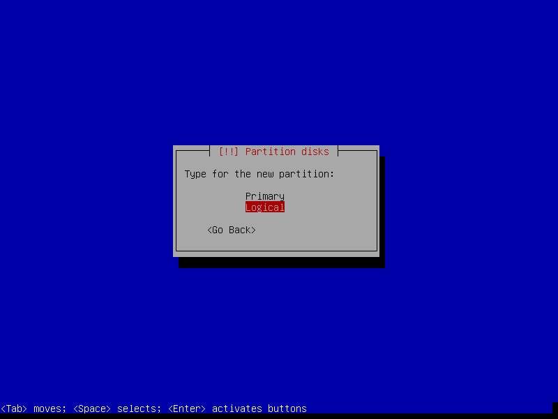

And for the mount point you **don't** have to **define anything** and hit **done**. Later you will return to this partition, and you will modify it to comply with the volumes required by the statement.

|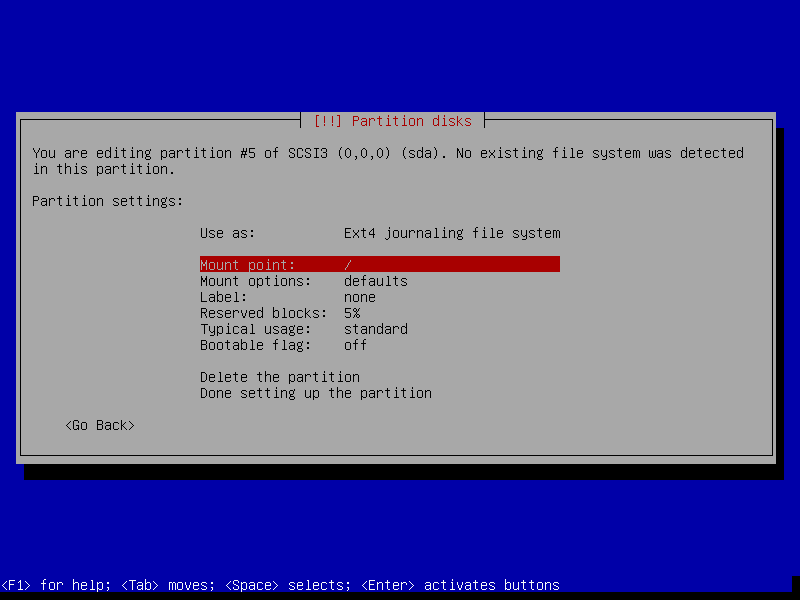||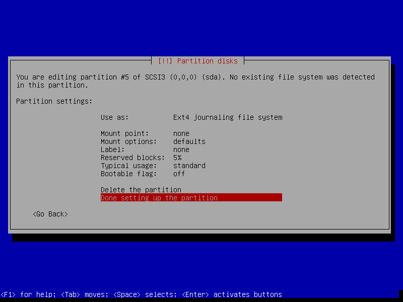|
|-|-|-|

### ENCRYPTING THE PARTITION
After creating the partition for the LVM, it is time to encrypt it, for this go to configure encrypted volumes.


If you have two partitions as it appears in the image, click **yes**.


And start **encrypting the partitions**, don't forget that the partition containing the boot doesn't have to be encrypted.


**Select** (select that disk and press space) the partition for **LVM** and **continue**.


Then click **done, finish** and **yes**. And wait for the encryption process to finish.

|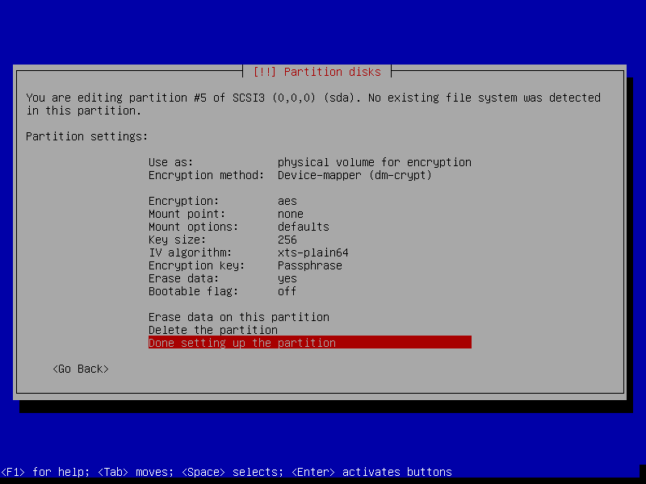|||
|-|-|-|

Once the installer finishes encrypting the data on the partition, you **must choose a decryption password**. This password must be strong, and you cannot forget it, otherwise you will not be able to access the Born2beroot machine.


### CONFIGURING LVM
#### Logical volume group creation
It is time to create the logical volumes that the exercise asks inside the encrypted partition.

|||
|-|-|

In order for LVM to be able to manage logical volumes, first a volume group must be created.


Now you must **assign a name to the group**, in my case I will use the same one that is used in the statement of the exercise “LVMGroup”.


Lastly, **select ONLY** the **partition** you have **encrypted** to the group, DO NOT assign the boot partition.


#### Create Logical Volumes
Now that you have the volume group created and the encrypted logical partition assigned to it, you need to create the logical volumes one by one. As an example, I will make the root, which must be present for both the mandatory and bonus parts. To do this go to **create Logical Volume**.


Select the group **where** you are going to **host the partition**.


And give it a **name** and **disk space**. In my case I will call it "root" and a size of 3GB should be enough to complete the objectives of the practice.

|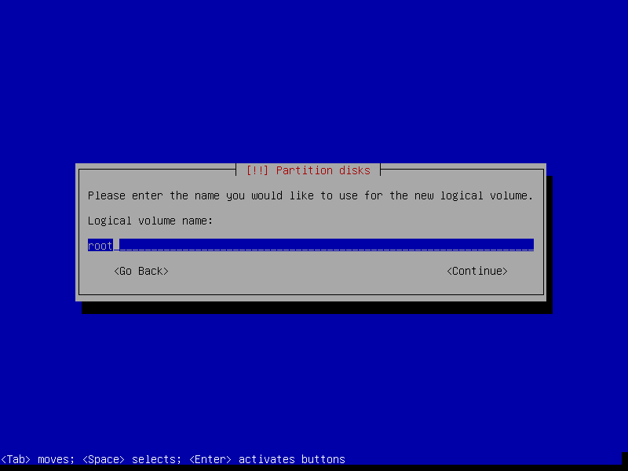||
|-|-|

Your first partition has already been created. Now you just must repeat the process…

1. Create a logical volume
2. Choose the group
3. Give it a name
4. Assign a disk space (below you have a screenshot of how I have organized the sizes of the different partitions[^2])

…until you have all the partitions that the exercise asks for (I recommend you also do the ones in the bonus part), when you have finished partitioning click finish.


#### Configuring Logical Volumes
Once the volumes have been created, it is time to assign them a “task” within the OS. So that, in this case Debian, can use them accordingly. To do this you have to specify the file system and mount point for each volume.

As an example, I will again use the root partition.


As I want to tell the OS how to use the partition, I will click on **use as:..**


I select **Ext4 journaling file system**.

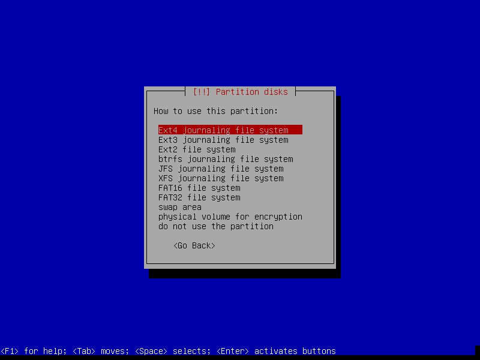

And as for the **mount point**, I choose the one that corresponds to the root partition.

||||
|-|-|-|

Now all you have to do is repeat the process again...

1. Choose a logical volume
2. Go to “use as”
3. Choose the Ext4 file system (except in swap, which you have to choose the “swap” file system and you don't have to select a mount point)
4. Select the mount point depending on the function that this partition is going to have (except for var-log that you have to put it manually in “/var/log”)

…until you have all the partitions that the exercise asks for, when you have finished partitioning, click **finish partitioning and write changes to disk**. Then click **yes**.

#### Debian base system installation
In this last step, the base system will be installed and for this, some parameters must be defined:
- When **scanning** click **no**
- For the Debian packages download server you have to choose a **country** (usually the closer the country to your location the better) and a **mirror**
- The **proxy** connection can be left **empty**
- And it is **not necessary** to participate in the **statistical study**

|||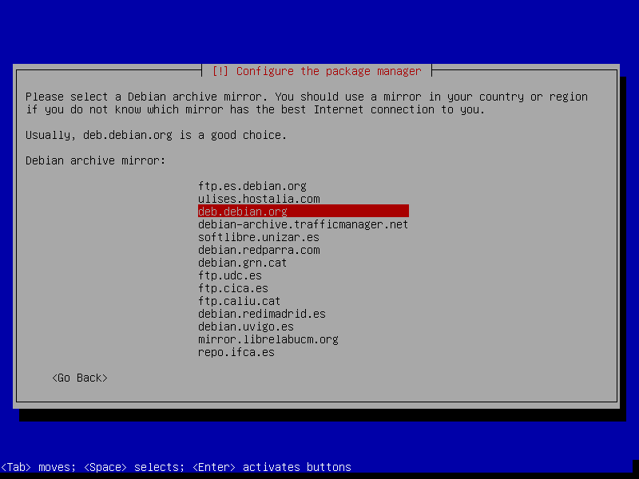|
|-|-|-|
|||

For the selection of software, it is not necessary to put **any**, what is needed will be installed later. So, **uncheck all the boxes** by selecting them and pressing the space bar. Then hit continue.


Click **yes** you want to install [GRUB](https://www.gnu.org/software/grub/)


And it will be installed in “**/dev/sda**”


END! You already have Debian installed on your VM.

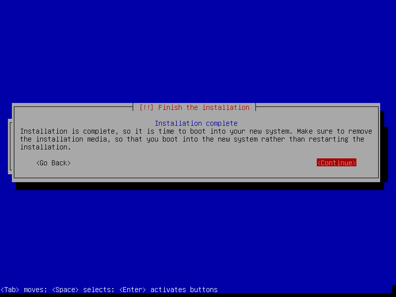

### LOGGING INTO Born2beroot
Now restart the VM. At boot it will ask you for the password to decrypt the encrypted partition, and then the credentials of the user you created at the beginning of the installation process.

To verify that the installation is correct, you can try a few commands:
- **cat /etc/os-release**. To check the operating system information
- **lsblk**. To review yours partitions
- **apt –v**. Check if the package manager is installed by default
- **date**. To check the time zone (It has to match the country you put in the installation). Although if it is incorrect, it is not very important for Born2beroot.

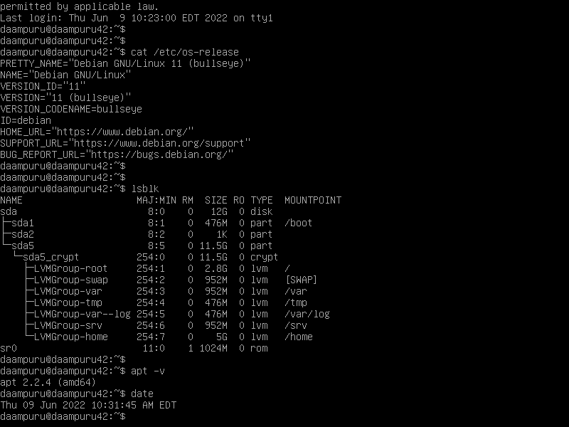

## 2. CONFIGURING A DEBIAN AS A SERVER
### [sudo](annex/5_Root_Superuser_Sudo.en.md) IMPLEMENTATION
#### sudo INSTALLATION
To install a program on the server, you have to log in as root.
```bash
su root
```
> Note that when you log in as root the console command prompt changes from '$' to '#' while you remain root.

Once as root, before installing anything, it is recommended to update the list of programs that can be downloaded from the repository. In addition to that, since the server is not yet in production, it is recommended to update the programs that are already installed on the system.
This is all done using the `[apt](annex/4_Debian_Package_Management.md)` utility:
```bash
apt update # Update the list of packages
apt upgrade # Upgrade packages installed on the system
apt install sudo # Install the sudo utility
```
Now it's time to give the privileges to execute sudo to the desired user. There are different ways to do this, but the most correct and appropriate way is to add the user to a group that has the privileges that you want to give them. When you install the sudo program, it already has a default group that has sudo privileges called "sudo".

Although to make sure of the name you can run the `sudo visudo` command and see if there is a group named like this:

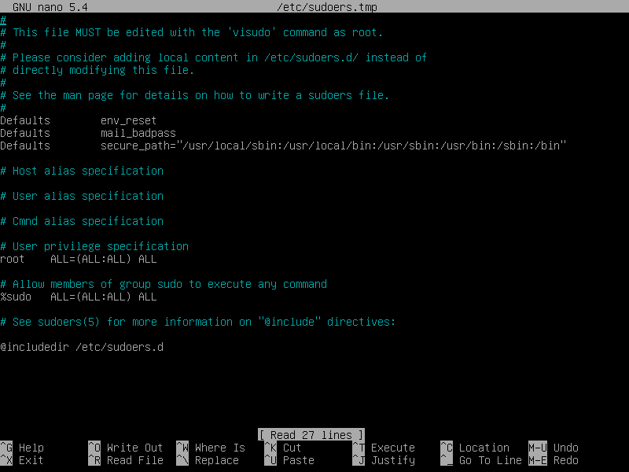

Explanation:
```bash
%sudo ALL=(ALL:ALL) ALL
└─┬─┘ └┬┘  └──┬──┘  └┬┘
  │    │      │      └────╴> The command itself
  │    │      └────> User who can execute the command
  │    └────> The host to which the match is applied
  └────> User (in this case group since it has the prefix '%') to which the command applies
```
> Knowing this, another of the many ways to give privileges to a user can be to add it directly and give it the privileges you want, but this is not usually a good practice.

To add the user to a group there are different ways, the one I use is:
```bash
sudo usermod -aG sudo daampuru
└┬─┘ └──┬──┘  ││ └┬─┘ └──┬───┘
 │      │     ││  │      └────> Is user itself
 │      │     ││  └────> The group you want to join the user to
 │      │     │└────> To the desired group
 │      │     └────> With the "append" options
 │      └────> To modify the login information of users
 └────> Run sudo command
```
> ATTENTION: Be very careful not to forget the *a* option since if you only put "-G" the selected user will be deleted from all the other groups in which he is and will only be in this one. An easier way is `adduser <username> sudo`

Once the user is added to the group, the login information of said user must be refreshed. This is done by logging out and logging back in:
```bash
exit # With this command you log out as root user
exit # With this second exit you log out as your normal user
```
Once logged in again with your normal user try to see if you can use sudo, executing a command that needs root permissions or you can also execute the command `whoami` tells you what user you are logged in with:
```bash
whoami # If you do it without sudo will return your normal username
sudo whoami # And if you do it with sudo it has to return that the root user has executed it
```

#### sudo CONFIGURATION
For security reasons, the Born2beroot practice requires making some extra configurations to the sudo settings that come by default:

- The sudo group has a maximum of 3 attempts to enter the correct password
- When sudo is used and the password is incorrect, a personalized message should appear
- For each command executed with sudo, both the input and the output must be archived in the */var/log/sudo/* directory.
- TTY[^3] mode must be enabled for security reasons.

To add these parameters to the sudo program you have to modify the *sudoers.tmp* file. To open/modify this file, it is recommended to use the command that provides sudo, instead of opening it as if it were a normal file. In addition you have to open it as root user.
```bash
sudo visudo
```
Now you have to add the following lines to the file:
```bash
Defaults passwd_tries=3 # Specify a maximum of 3 attempts
Defaults badpass_message="Logging attempts with wrong password, try again." # Custom error message
Defaults logfile="/var/log/sudo/sudo.log" # Place where interactions with sudo will be saved
Defaults log_input # Saves the inputs
Defaults log_output # Save the output
Defaults requiretty # Requires TTY to be open
```
> If the directory where you want to save the logs does not exist, you will have to create it with `mkdir`.

### AppArmor IMPLEMENTATION: sudo limitation
Since Debian 10 [AppArmor](annex/6_What_is_AppArmor.md) comes pre-installed in Debian, so I will use this one (Also it is easier to use). To see AppArmor is installed and running correctly, you have to execute the following:
```bash
sudo aa-status
```
And something similar to this should appear:
```bash
apparmor module is loaded.
3 profiles are loaded.
[...]
```
In this case, if everything is fine, leave the default configuration.

### IMPLEMENTATION OF [UFW](annex/7_What_is_UFW.md) (**U**ncompicated **F**ire**w**all)
#### INSTALLATION AND ACTIVATION
To install it do:
```bash
sudo apt install ufw
sudo ufw enable
```
If everything went well, the message *Firewall is active and enabled on system startup* should appear. Also, to see if UFW is actually running in the background, you can run the following command:
```bash
sudo ufw status verbose # NOTE: The "verbose" option is optional, it just adds more information to the response
```

#### RULES MANAGEMENT
Although at the moment it is not necessary to apply any specific rule, I am going to show you the first steps so that you know how to create, delete and monitoring the rules.

- Creation of rules
```bash
sudo ufw allow 4242 # Allow traffic to enter through port 4242
sudo ufw deny 8080 # Deny traffic from entering port 8080
```
> These rules do not only apply to the ports of your server, they can also be applied to IPs for example.

- Monitoring of active rules
```bash
sudo ufw status numbered
```

- Removal of rules
```bash
sudo ufw delete allow 4242
sudo ufw delete deny 8080

# Another way would be using the id you get with the status numbered command
sudo ufw delete 2
```
> NOTE: Be careful because if you try to delete more than one rule at the same time using the id you have to order them from highest to lowest, since if you start deleting the ones with the lowest value, the ones with the highest value will take those values.


### IMPLEMENTATION OF A [SSH](annex/8_What_is_SSH.md) SERVER IN Born2beroot
#### INSTALL
Another requirement of the practice is the ability to connect to your server remotely and do it through port 4242. To do this they tell you to use the SSH protocol, to be able to use it easily there are different programs, but the most used in Linux is **OpenSSH**, which can be implemented in two ways as a client (used to connect to another computer) and/or server (used for other computers to connect). You are interested in implementing a server with OpenSSH.
```bash
sudo apt install openssh-server
```
To view the status of the ssh server:
```bash
sudo systemctl status ssh
```

#### CONFIGURE THE SSH SERVER
 As you can see, the server is preconfigured to accept connections from port 22, see the line `Server listening on :: port 22`. In order for the server to only accept connections that come from port 4242 you have to modify the default ssh configuration. The configuration file is in */etc/ssh/sshd_config*.
```bash
sudo nano /etc/ssh/sshd_config
```
Once opened look for the line `# Port 22`, uncomment it and change the 22 to 4242.

|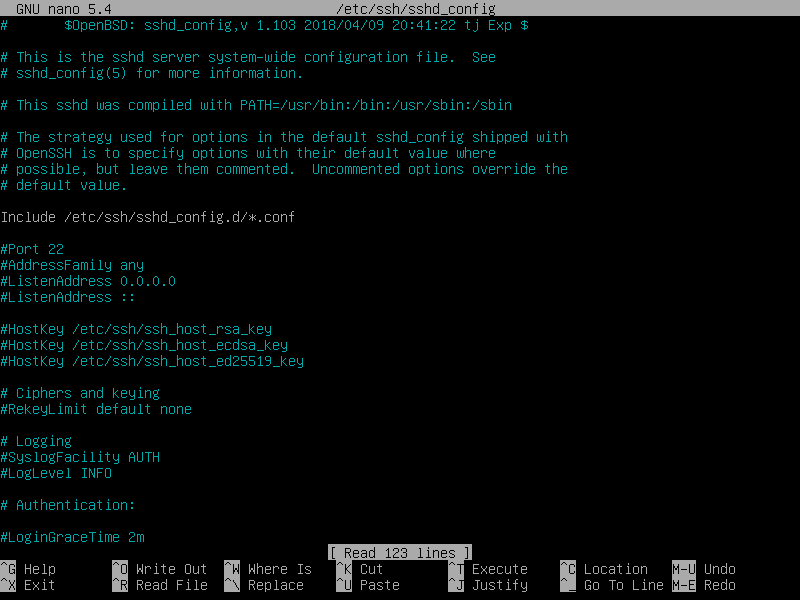|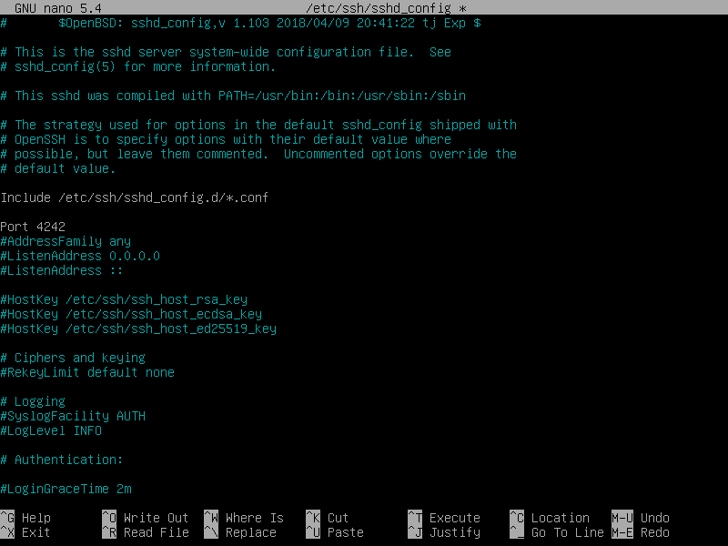|
|-|-|

Once the ssh server is saved, it should change the listening port automatically, if not, try restarting the ssh service.
```bash
sudo systemctl restart ssh
```
 Finally, you need to authorize the UFW firewall to allow inbound connections on port 4242. To adding this rule, you may need to remove a new rule that allows connections on port 22 that was created automatically when you installed OpenSSH.
```bash
sudo ufw allow 4242
sudo delete allow ssh # To delete port 22 rule
```

#### PORT FORWARDING WITH VIRTUALBOX
In order to connect to the VM from another computer via SSH you have to redirect the host port (the PC where you have the VM installed) to the virtual machine's own port. In case you work with VirtualBox go to the Born2beroot settings, once there go to *network -> Adapter 1 -> Advanced -> Port Forwarding*

||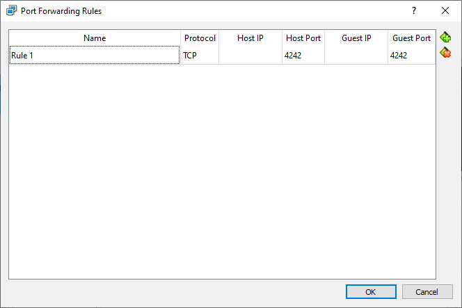|
|-|-|

Once this is done, you should be able to connect via ssh, but if you want to be sure, restart the service again.
```bash
sudo systemctl restart ssh
```

#### CONNECT TO AN SSH SERVER
To connect from another computer you need to have an ssh client installed. Assuming you already have it, all you have to do is open a terminal and
```bash
ssh daampuru@localhost -p 4242
└┬┘ └──┬───┘ └───┬───┘  │ └┬─┘
 │     │         │      │  └────> Port you want to connect through
 │     │         │      └────> Option to choose another port other than the default
 │     │         └────> IP you want to connect to
 │     └────> User of the system you want to connect to
 └────> Command to use the ssh client
```
> NOTE: Since the VM shares the IP address of the host, you can use the local IP address of the host. You can use *Localhost* which is an internal PC shortcut used to refer to its own IP address, which is 127.0.0.1 (you can use either one).

In the first connection through an ssh client, it asks you for a certificate to establish a secure connection.

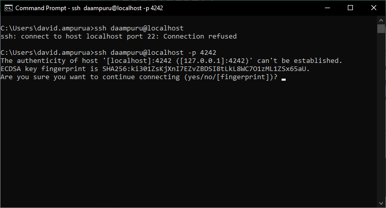

Once inside, it's like being on the Born2beroot server itself but remotely.


To disconnect from the SSH connection you just have to execute the `exit` command

### SERVER MONITORING
The next stage of the guide is to make the script *monitoring.sh* which must be executed every 10 minutes from the start of the computer and display the desired information in all active terminals. Information to display:

| Information                                                                           | Command                                                                            |
|---------------------------------------------------------------------------------------|------------------------------------------------------------------------------------|
| The architecture of your operating system and its kernel version.                     | uname -srvmo                                                                       |
| The number of physical cores.                                                         | grep 'physical id' /proc/cpuinfo \| unique \| wc -l                                |
| The number of virtual cores.                                                          | grep processor /proc/cpuinfo \| unique \| wc -l                                    |
| The RAM memory currently available on your server and its percentage of use.          | **Used:** free -h \| grep Mem \| awk '{print $3}'<br> **Total:** free -h \| grep Mem \| awk '{print $2}'<br> **Percentage:** free -k \| grep Mem \| awk '{printf("%.2f%%"), $3 / $2 * 100}'<br> |
| The currently available memory on your server and its usage as a percentage.          | **Used:** df -h --total \| grep full \| awk '{print $3}'<br> **Total:** df -h --total \| grep full \| awk '{print $2}'<br> **Percentage:** df -k --total \| grep full \| awk '{print $5}'<br> |
| The current percentage of usage of your cores (the CPU).                              | top -bn1 \| grep '^%Cpu' \| cut -c 9- \| xargs \| awk '{printf("%.1f%%"), $2 + $4}' |
| The date and time of the last reboot.                                                 | who -b \| awk '{print($3 " " $4)}'                                                 |
| Whether LVM is active or not.                                                         | if [ $(lsblk \| grep lvm \| wc -l) -eq 0 ]; then echo no; else echo yes; fi        |
| The number of active connections.                                                     | grep TCP /proc/net/sockstat \| awk '{print $3}'                                    |
| The number of users on the server.                                                    | who\| wc -l                                                                        |
| The IPv4 address of your server and its MAC (Media Access Control)                    | **IP:** hostname -I \| awk '{print $1}'<br> **MAC:** ip link show \| grep link/ether \| awk '{print $2} |
| The number of commands executed with sudo                                             | grep COMMAND /var/log/sudo/sudo.log \| wc -l                                       |

Some commands can only be executed by the root user, so you have 2 options:
1. You log in as root and create/modify the file
2. You do it with a normal user and then you change the owner (`chown`) to be root

Once the file is created you have to give it execution rights `chmod +x monitoring.sh`

#### SEND A MESSAGE TO EACH TERMINAL
To send a message to each terminal (broadcast) there is the `wall` command, which allows you to broadcast a message to all users at once on all terminals. In addition, you can receive as text to display the content of a file.

By default, the ad is prefixed with a banner, but that banner is optional in this project.
```bash
wall "message" # With banner
wall -n "message" # No banner
```

#### SEND MESSAGE EVERY 10 MINUTES
For this purpose, there is the `crontab` service (**c**h**ron**o **tab**le) that allows you to run scripts or software automatically when a specific event occurs that you you have assigned, such as a specific date and time or in a specific time interval.

This is a program that comes pre-installed with Debian itself and to make it run in the background whenever you boot the computer, use the following command:
```bash
systemctl enable cron
```
For programming jobs *cron* uses files called *crontab*. Logged in as root you have to create one of these files.
```bash
crontab -e * * * * * <command to execute>
         │ │ │ │ │ └────> Select the day of the week (0 - 6, 0 = Sunday)
         │ │ │ │ └────> Select the month of the year (1 - 12)
         │ │ │ └────> Select the day of the week (1 - 31)
         │ │ └────> Select the hour (0 - 23)
         │ └────> Select the minute (0 - 59)
         └────> Edit user crontabs
```
> NOTE: '*' means any value

To run the monitoring file every 10 minutes, use the following combination.
```bash
crontab -e */10 * * * * ./root/monitoring.sh
```
> Assuming */root/monitoring.sh* is where you have the file.

And for the output of the command to be displayed on all terminals you have to add the `wall` command to it, another way to do this is to enter the `wall` command directly in the script.
```bash
crontab -e */10 * * * * ./root/monitoring.sh | wall
```
However, this script will run every 10 minutes of every hour (00:10, 00:20, 00:30 ...) not every 10 minutes from **system boot**. To achieve this you will have a new script that combines the `sleep` command and knows what time the system started.

#### CALCULATE WHEN THE SYSTEM HAS STARTED
Create a new script called *sleep.sh*. This script will calculate the number of seconds between the precise boot time and the tenth minute. To do the calculations you can use the terminal based calculator `bc`, so you have to install it on your system first
```bash
sudo apt install bc
```
On the other hand, the source code of sleep.sh is:
```bash
#!bin/bash

# Get boot time minutes and seconds
BOOT_MIN=$(uptime -s | cut -d ":" -f 2)
BOOT_SEC=$(uptime -s | cut -d ":" -f 3)

# Calculate number of seconds between the nearest 10th minute of the hour and boot time:
# Ex: if boot time was 11:43:36
# 43 % 10 = 3 minutes since the 40th minute of the hour
# 3 * 60 = 180 seconds since the 40th minute of the hour
# 180 + 36 = 216 seconds between nearest 10th minute of the hour and boot
DELAY=$(bc <<< $BOOT_MIN%10*60+$BOOT_SEC)

# Wait that number of seconds
sleep $DELAY
```
Lastly, add this file to the crontab command, so cron will call `sleep.sh` and this past *X* time it will call `monitoring.sh`:
```bash
*/10 * * * * bash /root/sleep.sh && bash /root/monitoring.sh
```

### IMPLEMENTATION OF A STRONG PASSWORD SYSTEM
> NOTE: If you plan to do the bonus part, I recommend that you postpone this section until you have it done, so you won't have to change the passwords or worry about whether they will expire or not.

The features that you are asked to configure the password policy are:
- Password expires in 30 days
- The minimum number of days allowed before changing a password is 2
- The user must receive a warning message 7 days before his password expires.
- Minimum 10 characters long
- At least one capital letter and one number
- Cannot have more than 3 consecutive times the same character
- The password cannot contain the username.
- The password must have at least 7 characters that are not part of the old password (the root password does not have to follow this rule)

The rules above must be separated into two groups, the first 3 that are related with days and the rest that define how the passwords should be.

For the first three you have to modify the file:
```bash
sudo nano /etc/login.defs
```
And in the *Password aging controls* section (line 160) change the following values:
```bash
PASS_MAX_DAYS 30
PASS_MIN_DAYS 2
PASS_WARN_AGE 7
```
But beware, these changes are not automatically applied to pre-existing users (the *root* and *daampuru* in my case). To modify these rules you need to use the `chage` command:
```bash
sudo chage -M 30 root
sudo chage -M 30 daampuru
sudo chage -m 2 root
sudo chage -m 2 daampuru
sudo chage -W 7 root
sudo chage -W 7 daampuru
# To check, the "-l" flag is used to see the rules it has set
sudo chage -l root
sudo chage -l daampuru
```
To apply the other features you need to download the following package:
```bash
sudo apt install libpam-pwquality
```
And to impose the characteristics that you want in the passwords, you have to configure the file */etc/security/pwquality.conf*
```bash
# Number of characters in the new password that must not be present in the
# old password.
difok = 7
# The minimum acceptable size for the new password (plus one if
# credits are not disabled which is the default)
minlen = 10
# The maximum credit for having digits in the new password. If less than 0
# it is the minimun number of digits in the new password.
dcredit = -1
# The maximum credit for having uppercase characters in the new password.
# If less than 0 it is the minimun number of uppercase characters in the new
# password.
ucredit = -1

# [...]

# The maximum number of allowed consecutive same characters in the new password.
# The check is disabled if the value is 0.
maxrepeat = 3

# [...]

# Whether to check it it contains the user name in some form.
# The check is disabled if the value is 0.
usercheck = 1

# [...]

# Prompt user at most N times before returning with error. The default is 1.
retry = 3
# Enforces pwquality checks on the root user password.
# Enabled if the option is present.
enforce_for_root

# [...]
```
Lastly, change your root and user passwords to comply with the new password policy:
```bash
sudo passwd <user/root>
```

### MANAGEMENT OF HOSTNAME, USERS AND GROUPS
The last thing to keep in mind is that at the time of the defense you will be asked to:
- Change the hostname of the system
- Create a new user, change the name...
- And add it to a group

#### MODIFY HOSTNAME
To modify the hostname you have 2 options:
1. Use the command `sudo hostnamectl set-hostname <new_hotsname>`
2. Directly edit the file */etc/hostname*
3. NOTE: If you get the error `sudo: unable to resolve host <new hostname>: Name or service not known` you should also add it to the */etc/hots* file

To check that the name has actually changed you can run:
```bash
hostnamectl status
```
> If you see that the name has not changed yet, try restarting the computer.

#### USER MANAGEMENT
Useful commands to manage users:

| Command | Description |
|------------------------------------------------------------------------------------|----------------------------------------------------------------------------|
| adduser                                                                            | Creates a new complete user                                                |
| useradd                                                                            | Creates a new user                                                         |
| usermod                                                                            | Changes the user's paramenters: -l (username), -c (full name), -g (groups) |
| userdel -r                                                                         | Deletes a user and all associated files                                    |
| id -u                                                                              | Displays user ID                                                           |
| users                                                                              | Show a list of all currently logged in users                               |
| cat /etc/passwd \| cut -d ":" -f 1<br>*or*<br>cat /etc/passwd \| awk -F '{print $1}' | Displays a list of all users on the machine                              |

#### GROUP MANAGEMENT
Useful commands to manage groups:

| Command      | Description                             |
|--------------|-----------------------------------------|
| groupadd     | Creates a new group                     |
| gpasswd -a   | Adds a user to a group                  |
| gpasswd -d   | Removes a user from a group             |
| groupdel     | Deletes a group                         |
| id -g        | Shows a user's main group ID            |
| getent group | Displays a list of all users in a group |


## 3. BONUS PART
In the bonus part, apart from creating the extra partitions that were requested at the time of the OS installation, you have to create a web page ([here](annex/9_Brief_Introduction_to_the_Websites.md) you have a small introduction) with **WordPress** . And as a backend they tell you that you must implement the following:
- The HTTP server to implement must be **Lighttpd**
- To program the server for the backend part you have to use **PHP**
- Regarding the implementation of the database, **MariaDB** will be used

### PHP
At the time I am writing this guide, when installing PHP if you run `sudo apt list php` you can see that in Debian 11 the stable version of PHP is 7.4, although version 8 is already available. Initially with version 7.4 you shouldn't have any problems. In addition to PHP 7.4, the *php-common*, *php-cgi*, *php-cli* and *php-mysql* packages are also required as they are required by WordPress.

```bash
sudo apt update
sudo apt install php php-common php-cgi php-cli php-mysql
php -v # To check which version is installed
```

### LIGHTTPD
Before starting with the installation of lighttp, if you have installed PHP first, it is possible that apache2 has been installed as a php dependency (to check if it is in the system or not, you can execute `sudo apt list apache2` and if at the end of the package it says *[installed]* is installed), so to avoid possible conflicts if it is installed run `sudo apt purge apache2` to remove it from the system.

To install lighttpd you simply have to run:

```bash
sudo apt install lighttpd
lighttpd -v # To check that it has indeed been installed
```

Once installed, you have to activate it and make the service start to work in the background when you start the computer.

```bash
sudo systemctl start lighttpd
sudo systemctl enable lighttpd
sudo systemctl status lighttpd
```

Once you have verified with the `status` command that the service is running, you have to tell the firewall to allow traffic to pass through the *http* protocol (or what is the same for port 80 and TCP/IP protocol)

```bash
sudo ufw allow http
sudo ufw status
```

And since you've already done port 4242 when allowing SSH connections, you have to reroute the VM's ports to its host. *Settings >> Network >> Adapter 1 >> Advanced >> Port Forwarding* and so that the host can continue using port 80 you are going to use its port 8080, so you will not have interference with data traffic:

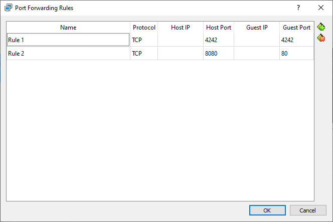

To test that the Born2beroot web server is working properly, try to connect to it. Go to the VM host browser and since the VM is hosted on your own computer, type *localhost* (or 127.0.0.1) as address and 8080 as port (which is actually 80 of the VM).

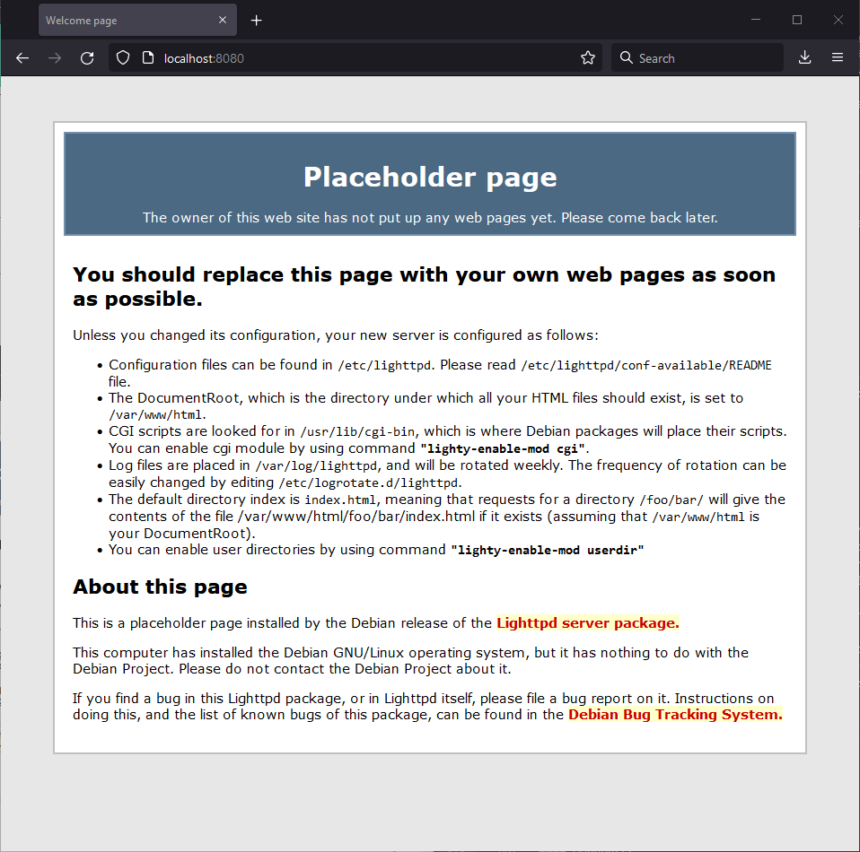

PERFECT! You now have your web server running correctly on the VM.

#### ENABLE FastCGI (**Fast** **C**ommon **G**atewway **I**nterface)
But we still have to make the dynamic pages that are created with PHP visible. When installing PHP, a directory has been created where to leave the web pages created with PHP */var/www/html/*, to create a simple page that shows the php information execute:

```bash
sudo nano /var/www/html/info.php
```

Inside the script write:

```php
<?php
phpinfo();
?>
```

If you search for the address *http://localhost/info-php* in your browser, it will respond with the error *403 Forbidden*.

To fix this you have to understand the paradigm of dynamic and static web pages. In **static websites**, the web server immediately sent pre-written HTML pages for every HTTP request it received. On the other hand, in **dynamic websites**, the web server does not respond immediately, but instead transfers the HTTP request data to an external application (in this case PHP) that interprets it and returns the generated HTML code to the web server, and the web server responds to the request.

In the communication between the external application and the web server is where FastCGI comes in, which is a binary protocol that allows such communication. You need to configure this protocol between lighttpd and PHP in order to access the *info.php* page from a web browser.

```bash
sudo lighty-enable-mod fastcgi # Enable CGI mode
sudo light-enable-mod fastcgi-php # Enable CGI communication with PHP
sudo service lighttpd force-reload # Restart the service to make the changes
```

Now if you try to read the *info.php* page on your computer you will see something like this:


### MariaDB
For Wordpress to store web data, MariaDB must be used. To install it do:

```bash
sudo apt install mariadb-server
```

Now start it and make it always run in the background when you start your computer.

```bash
sudo systemctl start mariadb
sudo systemctl enable mariadb
systemctl status mariadb
```

To do a [more secure installation](https://dev.mysql.com/doc/refman/5.7/en/mysql-secure-installation.html) run:

```bash
sudo mysql_secure_installation
```

Then it's time to fill in the fields that ask you when executing the previous command

```bash
Enter current password for root (enter for none): <Enter>
Switch to unix_socket authentication [Y/n]: Y
Set root password? [Y/n]: Y
New password: SuperMoon!26
Re-enter new password: SuperLuna!26
Remove anonymous users? [Y/n]: Y
Disallow root login remotely? [Y/n]: Y
Remove test database and access to it? [Y/n]: Y
Reload privilege tables now? [Y/n]: Y
```

Lastly, restart MariaDB for the new configuration to take effect.

```bash
sudo systemctl restart mariadb
```

Once installed, you will log in to MariaDB as root (NOTE as root of the database, not the root user of the VM).

```bash
mysql -u root -p
```

> Before starting to use the database, you have to know that you have to use its own language (*SQL*) to be able to manage the databases and their tables. I recommend that you pause and learn how to do CRUD (**C**reate, **R**ead, **U**pdate and **D**elete) in SQL (here is a [cheatsheet ](annex/SQL_Chearsheet.png) and [here](https://sqliteonline.com/) an online compiler for you to try). This is a basic thing in all databases you want to use.

To create the WordPress database you have to:

```SQL
MariaDB [(none)]> CREATE DATABASE wordpress; --Create the database named "wordpress_db"
MariaDB [(none)]> CREATE USER 'admin'@'localhost' IDENTIFIED BY 'check42_MVP'; --Create a new user with password
MariaDB [(none)]> GRANT ALL ON wordpress_db.* TO 'admin'@'localhost' IDENTIFIED BY 'check42_MVP' WITH GRANT OPTION; --Give super user privileges to "admin" in the context of that database
MariaDB [(none)]> FLUSH PRIVILEGES;
MariaDB [(none)]> EXIT;
```

To verify that you have created the database, you can run MariaDB while logged in as root:

```bash
MariaDB [(none)]> show databases;
```

The output should be similar to:

```bash
+--------------------+
| Database           |
+--------------------+
| information_schema |
| mysql              |
| performance_schema |
| wordpress          |
+--------------------+
```

### WORDPRESS
Finally it's time to install and configure Wordpress

```bash
sudo apt install wordpress
```

Once installed, you will base yourself on the example script that WordPress itself has in */usr/share/wordpress/wp-config-sample.php*[^4] and */usr/share/wordpress/wp-admin *, copy it to the web server directory, open it with a text editor (`nano` for example) and modify the following sections:

```bash
sudo cp -r /usr/share/wordpress/ /var/www/html/
sudo mv /var/www/html/wp-config-sample.php /var/www/html/wp-config.php
sudo nano /var/www/html/wp-config.php
```

```php
<?php
/* [...] */
/** The name of the database for WordPress */
define( 'DB_NAME', 'wordpress' );

/** Database username */
define( 'DB_USER', 'admin' );

/** Database password */
define( 'DB_PASSWORD', 'SuperMoon!26' );

/** Database host */
define( 'DB_HOST', 'localhost' );
/* [...] */
?>
```

Finally, you have to give permissions to the user `www-data` ([here](https://askubuntu.com/questions/873839/what-is-the-www-data-user) I leave you a brief explanation of why what is used), which has been created in the web server installation, so that it can read the web page files.

```bash
sudo chown -R www-data:www-data /var/www/html/
sudo chmod -R 755 /var/www/html/
sudo systemctl restart lighttpd
```

As you can see by putting *http://localhost:8080/wordpress/wp-admin/install.php* in your browser you will get a small wordpress set-up, you just have to fill it as you want.

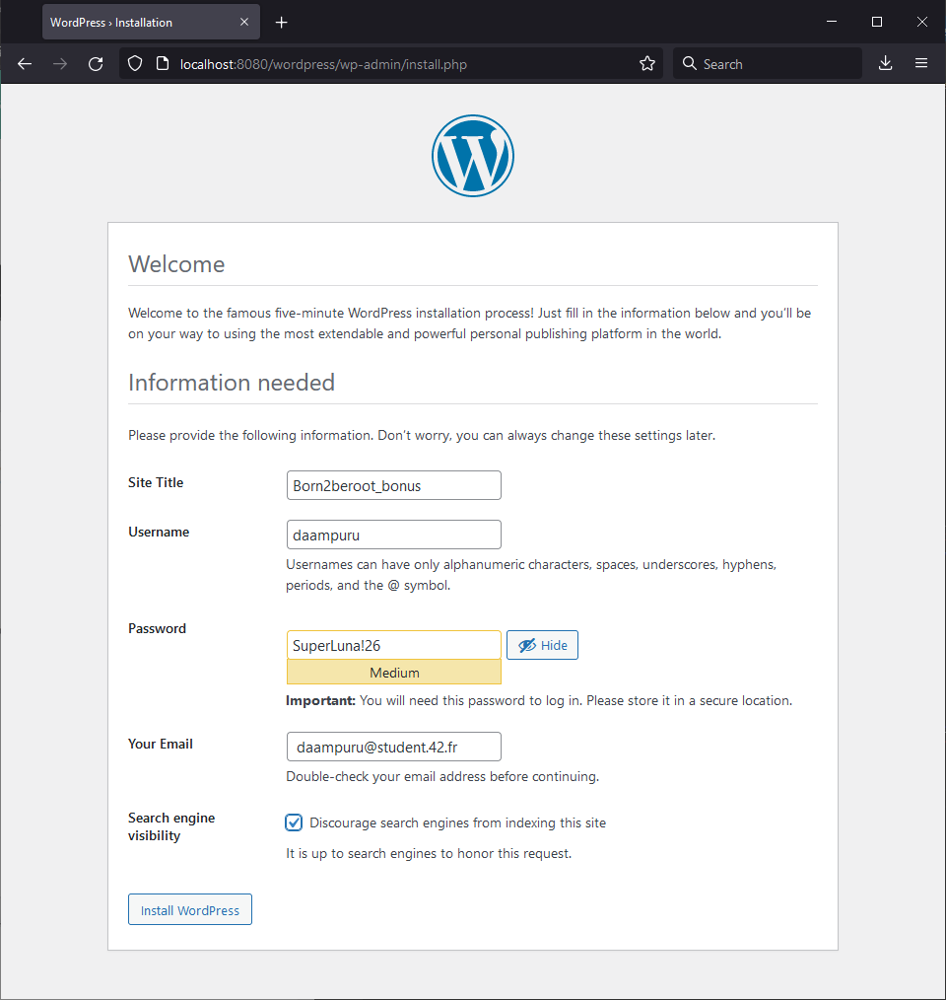

### EXTRA SERVICE: Fail2Ban
As an extra service, one of the most useful in my opinion for any server (even more so if you have an SSH server activated as is your case) is `Fail2ban`[^5], it is a program for preventing intruders in a system, which acts by penalizing or blocking remote connections that attempt access by brute force. If you encounter multiple failed login attempts or automated attacks from an IP address, you can block it with your firewall, either temporarily or permanently.

For the installation:

```bash
sudo apt install fail2ban
sudo systemctl start fail2ban
sudo systemctl enable fail2ban
sudo systemctl status fail2ban
```

And for the configuration you have to modify the */etc/fail2ban/jail.local* file:

```bash
sudo cp /etc/fail2ban/jail.conf /etc/fail2ban/jail.local
sudo nano /etc/fail2ban/jail.local
```

Go to the section about SSH (on line 280) and add the following:

```bash
# [...]

#
# SSH servers
#

[sshd]

# To use more aggressive sshd modes set filter parameter "mode" in jail.local:
# normal (default), ddos, extra or aggressive (combines all).
# See "tests/files/logs/sshd" or "filter.d/sshd.conf" for usage example and details.
#mode = normal
enabled = true
maxretry = 3
findtime = 10m
bantime = 1d
port = 4242
logpath = %(sshd_log)s
backend = %(sshd_backend)s

# [...]
```

Once you have everything working, to see the logs of failed attempts you just have to do the following:

```bash
sudo fail2ban-client status
sudo fail2ban-client status sshd
sudo tail -f /var/log/fail2ban.log
```

To test that Fail2ban is actually banning IP addresses, you can change the SSH ban time to a lower value, such as 15 minutes, in the /etc/fail2ban/jail.local configuration file. It then tries to connect multiple times from the host machine via SSH with the wrong password. After a few tries, it should refuse the connection and the fail2ban-client status sshd command should show the banned IP address.

And that's it. You already have Born2beroot finished.

## EXTRA: POSSIBLE ERRORS
#### \*ERROR\* Failed to send host log message
At machine boot, you may notice the following error: *[DRM :vmw_host_log [VMWGFX]] \*ERROR\* Failed to send host log message*. It is a small issue with the graphics controller which does not affect the machine’s operation. However, it isn’t very nice to see. You can easily solve this error by changing the graphics controller:

1. Turn off the virtual machine,
2. Go to VirtualBox >> Machine >> Settings,
3. Go to Display >> Screen >> Graphics Controller,
4. Choose VBoxVGA.


[^1]: These are the latest stable versions of the respective programs on the date this exercise is being carried out.

[^2]: If you give a very low value to “var” when installing the base system, it can give you problems.

[^3]: TTY (Text/Terminal) or Graphic (Window Manager) mode. From the point of view of a server, starting in terminal mode saves resources, since almost all the queries that we carry out on it are usually managed through SSH.

[^4]: [Here](https://blog.ostermiller.org/install-wordpress-apt-ubuntu-host-multiple-blog-domains/) you have everything that installs and where wordpress installs it do it through `apt `

[^5]: [Here](https://www.youtube.com/watch?v=PAK7I1cKwzA) I leave you a very good explanatory video of the great Pelado Nerd
