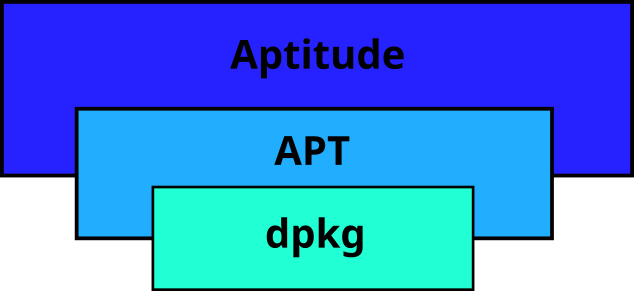

# Installing software on Debian
On Linux kernel operating systems, such as Debian, software is installed using software packages. These packages have everything you need to implement the expected functionality of the software on your computer. And the management of the packages is done through different [specialized programs](https://www.debian.org/doc/manuals/debian-faq/pkgtools.en.html) for handling these packages, some of them allow you to handle them at a low level (eg: dpkg) and others at a higher level (eg: synaptic).

## [APT](https://wiki.debian.org/Apt) (**A**dvanced **P**ackaging **T**ool)
Based on my personal experience, it is the package manager I use the most as it comes pre-installed on most Linux distributions.

APT fetches packages from official sources (called [repositories](https://wiki.debian.org/DebianRepository)) to install, update or remove them along with their dependencies. It can only be used through the command line.

In the image above you can see the flow that is followed when managing packages.

## Aptitude
Aptitude is another packet manager, but it is a higher level than APT. It integrates the functionalities of APT, adds its own ones and offers a graphical interface in addition to the text-based interface. It is also capable of displaying more information than APT. Aptitude is also more efficient at resolving conflicts during installs and removals, and we can ask why a certain package is recommended with the `why` and `why-not` commands.

Here you can see the integration relationship between dpkg, APT and Aptitude:

