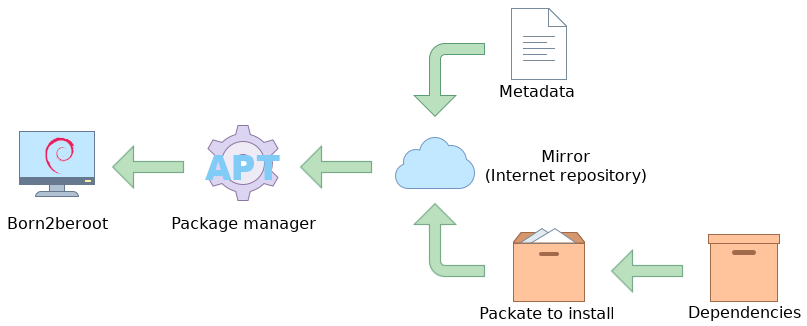

# Instalación de software en Debian
***[English](4_Debian_Package_Management.md) version***

En los sistemas operativos con el kernel Linux, como Debian, el software se instala mediante paquetes software. Estos paquetes tienen todo lo necesario para implementar en el equipo la funcionalidad esperada del software. Y la gestión de los paquetes se hace mediante diferentes[ programas especializados](https://www.debian.org/doc/manuals/debian-faq/pkgtools.en.html) para el manejo de estos, los cuales permiten gestionarlos a muy bajo nivel (ej.: dpkg) o a alto nivel (ej.: synaptic).

## [APT](https://wiki.debian.org/es/Apt) (**A**dvanced **P**ackaging **T**ool)
En base a mi experiencia personal, es el gestor de paquetes que más uso ya que viene preinstalado en la mayoría de las distribuciones de Linux.

APT obtiene los paquetes de fuentes oficiales (llamados [repositorios](https://wiki.debian.org/DebianRepository)) para instalarlos, actualizarlos o eliminarlos junto con sus dependencias. Solo se puede usar a través de la línea de comando.

En la imagen de arriba se puede ver a grandes rasgos el flujo que se sigue a la hora de cómo gestionar los paquetes.

## Aptitude
Aptitude es otro manejador de paquetes, pero de nivel superior a APT. Integra las funcionalidades de APT, añade otras propias y ofrece una interfaz gráfica además de la interfaz basada en texto. También es capaz de mostrar más información que APT. Aptitude también es más eficaz en la resolución de conflictos durante las instalaciones y eliminaciones, y podemos preguntarle por qué se recomienda un determinado paquete con los comandos `why` y `why-not`.

Aquí puedes ver la relación de integración entre dpkg, APT y aptitude:

