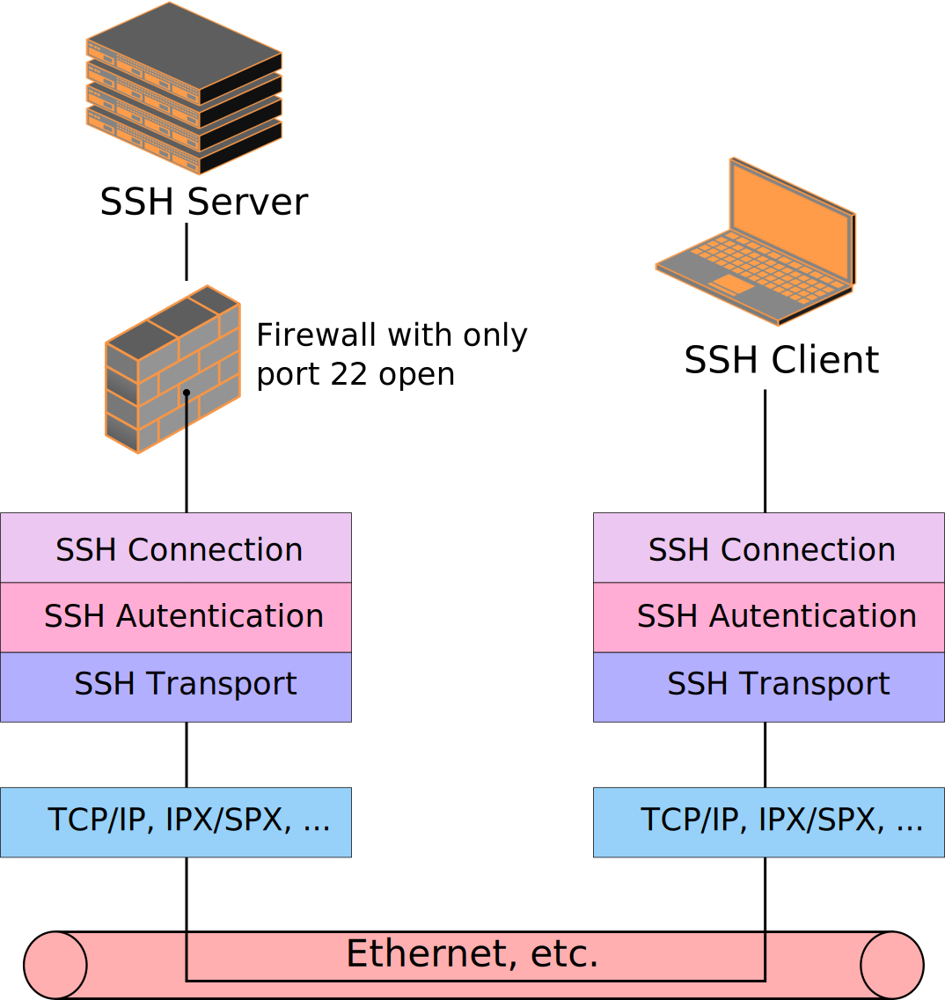

# ¿Qué es SSH?
SSH (**S**ecure **Sh**ell) es un servicio/protocolo usado para la conexión remota a un servidor por medio de un canal seguro en el que toda la información está cifrada. Aunque se puede usar para funcionalidades como "tunel" para pasar los datos de otro protocolo no seguro por SSH. Utiliza una la arquitectura cliente/servidor y lleva imcorporado la encriptación de la conexión.

SSH es la evolución de otros protocolos más viejos e inseguros como telnet. El protocolo SSH proporciona los siguientes tipos de protección:
- Después de la conexión inicial, el cliente puede verificar que se está conectando al mismo servidor al que se conectó anteriormente, gracias a los certidficados.
- El cliente transmite su información de autenticación al servidor usando una encriptación robusta de 128 bits.
- Todos los datos enviados y recibidos durante la sesión se transfieren por medio de encriptación de 128 bits, lo cual los hace extremadamente difícil de descifrar y leer.
- El cliente tiene la posibilidad de reenviar aplicaciones X11 desde el servidor. Esta técnica, llamada reenvío por X11, proporciona un medio seguro para usar aplicaciones gráficas sobre una red.

## Ubicación en el modelo OSI

SSH es un protocolo de comunicación que se sienta al menos Capa 7 (Aplicación) del Modelo OSI. En estricto rigor SSH cubre las capas 5, 6 y 7 del OSI, porque provee la interface de conexión de la aplicación (capa 7), un procedimiento para (des)encriptación y transferencia (capa 6) y gestión de autenticación de sesión con/sin encriptación por canales especiales (capa 5).

En cuanto a las capas que utiliza SSH, serian:
- **Aplicación:** SSH
- **Transporte:** TCP
- **Red:** IP (IPv4 y IPv6)

